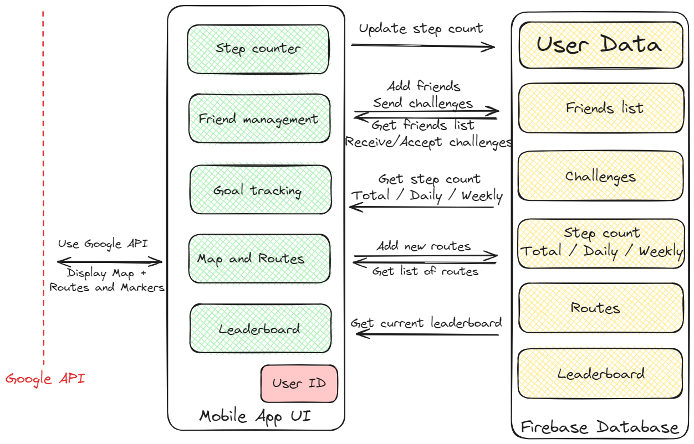

# Functional Requirements

## Key features of the MVP

### Step Counter
A basic step counter that tracks the user's steps. It keeps note of the date to distinguish between daily steps made, weekly steps made, and total steps. The step count can be accessed by the user on the progression page, where they can see their daily and weekly step count, which update in real time as the user is taking steps. The user can access the total number of steps he/she took in the profile page.

### Friend System
Allows users to add friends and view their activity, as well as send challenges to friends to compete. Users can send friend requests to other users through the friends menu. User can also accept friend requests, which adds both users to each others' friends list. Accepting friend requests happens through the notifications menu.

### Daily and Weekly Step Goals
Users can set and track personal daily and weekly step goals. Users can set a step goal for a day or week, and can see their progress towards this goal. This happens on the progression page. Users earn points/score upon achieving these goals.

### Challenges
Various step-based challenges that users can compete in with friends. These challenges are intiated by a user who sends a challenge to another user in their friends list. The other user receives a notification on the app and can choose to accept the challenge. The users compete to finish the challenge, with points/score awarded for completion.

### Map and Route Features
Interactive map feature enabling users to create and follow routes. Users have access to a worldwide map. They can create routes and add checkpoints to them with pictures of the location, so that other users can follow the route and match the same checkpoint. Users can use a search feature to search nearby routes created by other users, or search for routes in a location of their choice using the search bar. Users can start following existing routes, and earn points/score by doing so. App tracks progress along the route when following it, and ensures that the user followed the route without detours or shortcuts.

### Score System and Leaderboards
A comprehensive scoring system tied to user activity. Points/score are awarded for completing goals, challenges, and routes (Number of points/score depend on the number of steps of the step goal or the challenge, and the length of route). Leaderboards display rankings among friends and globally to foster a competitive spirit and reward users who try to be the most active. Users can access a global leaderboard which holds the ranking of all users, or a friends leaderboard, that ranks only the user with other users within his/her friends list.

## Architectural diagram

## Key internal functionalies

### Step Counter
The app uses the mobile device's built-in step detector sensor to detect when a step is made. When a step is made, the app records the date, and updates the total step count on the database, as well as the weekly and daily step counts according to the date. In offline mode the app instead simply caches this information, and adds the values from the cache to the database the next time the device is connected to the internet.

### Friend System
The app interfaces with Firebase Realtime Database to manage friend requests and acceptances. When a user first logs into StepQuest, the app requests that he/she set his/her username. The database keeps track of users' usernames, and provides this information to the app to allow all users to search for others by username to add friends. When adding friends, the request is saved on the database. The app checks the database for any friend requests to add to the notification tab, and updates the database based on whether the request was accepted or denied.

### Daily and Weekly Step Goals
The app uses the database to check the number of steps taken both daily and weekly, and the step goals. The app updates the step goals when the user decides to set new goals. The app also gets the step count from the database, and keeps updating the value as it changes so that the user can see their progress happening in realtime. In offline mode, updating the step goal happens on the cache, and the cached value is written to the database the next time the device is connected to the internet. The app handles the addition of points/score for completing a goal by updating the database.

### Challenges
The app uses the database to manage challenges and challenge progress. The database holds all challenges alongside the challenge information, including the users, the challenge type, end date, challenge goal, etc. The app accesses the challenges list and checks the user's current progress to verify if the challenge is complete. The app handles deletion of completed challenges and handles addition of points/score for completing a challenge by updating the database.

### Map and Route Features
The app uses the device's GPS and the Google Maps API to allow users to use an interactive map, and to create, save, and follow routes. The Google Maps API allows the use of an interactive world map. The app provides real-time tracking using GPS for coordinates, and Google Maps API to place marker on the map. The app also uses the GPS for tracking when a user is creating a route, or adding a checkpoint. If the user decided to add a picture to the checkpoint, the app uses the device's camera to allow the user to take a picture. The created route, alongside any checkpoints and pictures, are saved to to the database when the user finishes creating the route. The database is used by the app to access the list of routes, with any associated checkpoint and images. The app handles the filtering of routes by location. The app uses the Google Maps API to display the routes, and when the user chooses to follow a route, the GPS is used to ensure the user is correctly following the route, and when the user wants to match a checkpoint for a route he/she is following, the app uses the camera. The app handles the addition of points/score for completing a route by updating the database.

### Leaderboard System
The app accesses the databse which maintains an up-to-date list of users' score. The app handles the ordering of users by score, and the filtering of users not in the current user's friends list for the friends leaderboard.